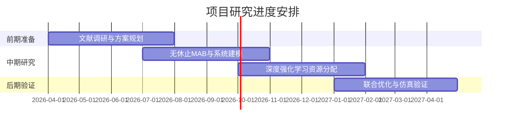
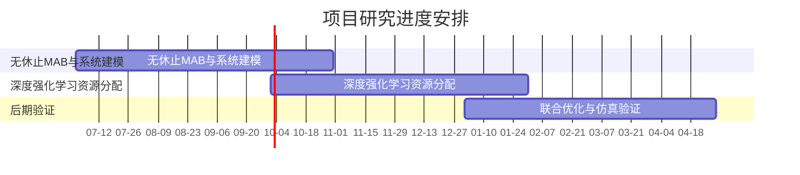

<h2>总体日程规划



<h3>详细日程规划


   


```mermaid
gantt
    title 项目详细进度安排(按人)
    dateFormat YY-MM-DD
    axisFormat %m-%d
    tickInterval 2week
    section 项目节点
            无休止MAB与系统建模 :a2, 2026-07-01, 2026-10-31
            深度强化学习资源分配:a3, 2026-10-01, 2027-01-31
            联合优化与仿真验证 :a4, 2027-01-01, 2027-04-30
    section 刘
        复现张晨文章:l1, 26-07-01, 26-08-15
        对文章的所有ref找根据，翻看引文：:l2,after a1,9d
        组织组员对成果挑刺，同时帮助组员构建框架：:milestone,26-08-18
        开学 同步进度:milestone,l3，26-08-31
        :l4,after a2
    section  陈
        完成国际计划书:26-08-29,26-09-10
        和L思考多智能体方案:26-09-05，26-09-10
        
    section 邓
        依照复现的单智能体方案完成单个智能体构建:d1,after l3,26-09-06
    section 方
        依照复现的单智能体方案完成单个智能体构建:f1,after l3,26-09-06
        

```